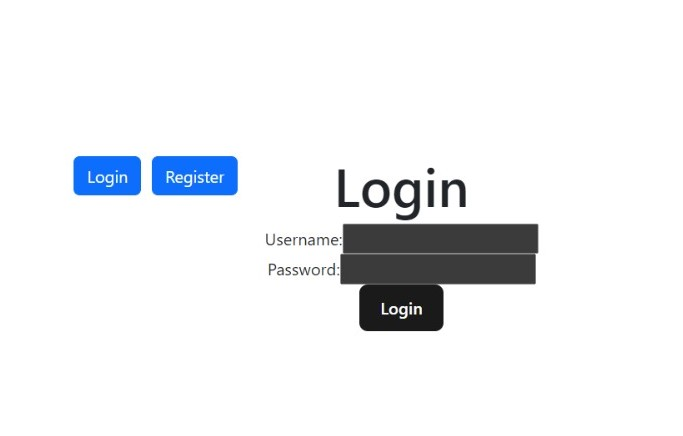
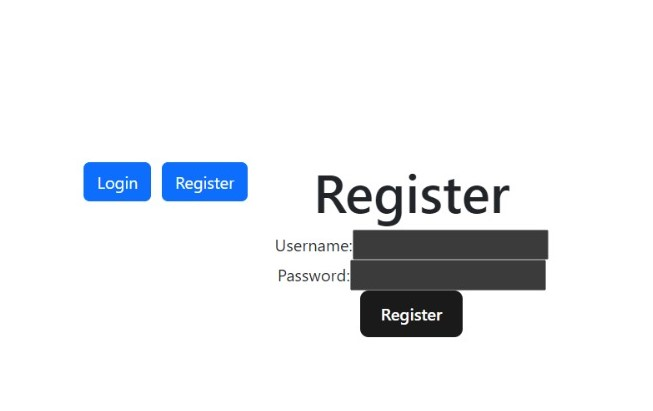
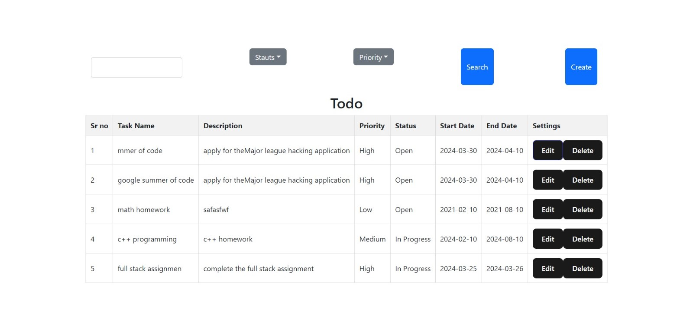

```markdown
# Todo Application

This is a simple Todo application built using React for the frontend and Django with Django REST Framework for the backend.

## Screenshots






## Installation

### Frontend (React)

1. Clone the repository:
   ```bash
   git clone https://github.com/your-username/todo-app.git
   ```

2. Navigate to the frontend directory:
   ```bash
   cd todo-app/frontend
   ```

3. Install dependencies:
   ```bash
   npm install
   ```

4. Start the development server:
   ```bash
   npm start
   ```

5. Open your browser and visit http://localhost:3000 to view the application.

### Backend (Django)

1. Clone the repository (if not already done):
   ```bash
   git clone https://github.com/your-username/todo-app.git
   ``` 

2. Navigate to the backend directory:
   ```bash
   cd todo-app/backend
   ```

3. Create a virtual environment (recommended):
   ```bash
   python -m venv venv
   ```

4. Activate the virtual environment:
   - On Windows:
     ```bash
     venv\Scripts\activate
     ```
   - On macOS and Linux:
     ```bash
     source venv/bin/activate
     ```

5. Install dependencies:
   ```bash
   pip install -r requirements.txt
   ```

6. Apply migrations:
   ```bash
   python manage.py migrate
   ```

7. Start the Django development server:
   ```bash
   python manage.py runserver
   ```

8. The backend server should now be running at http://localhost:8000.


